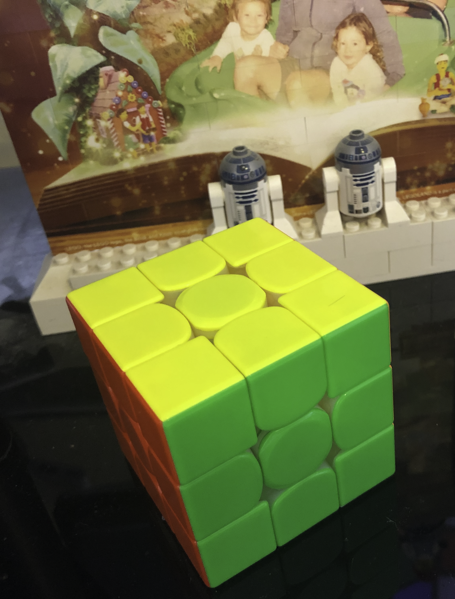
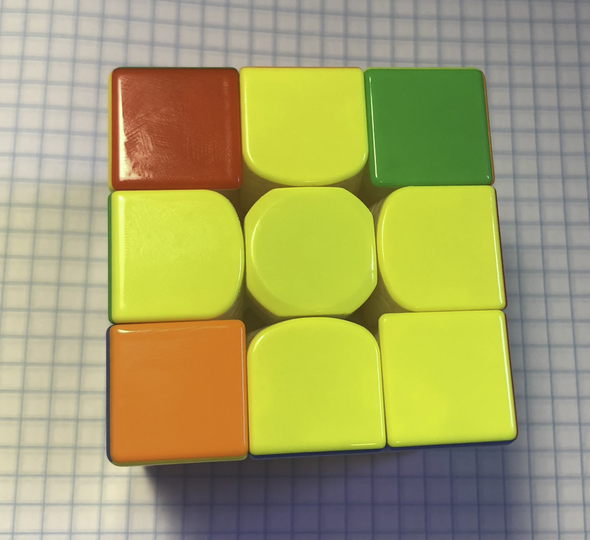
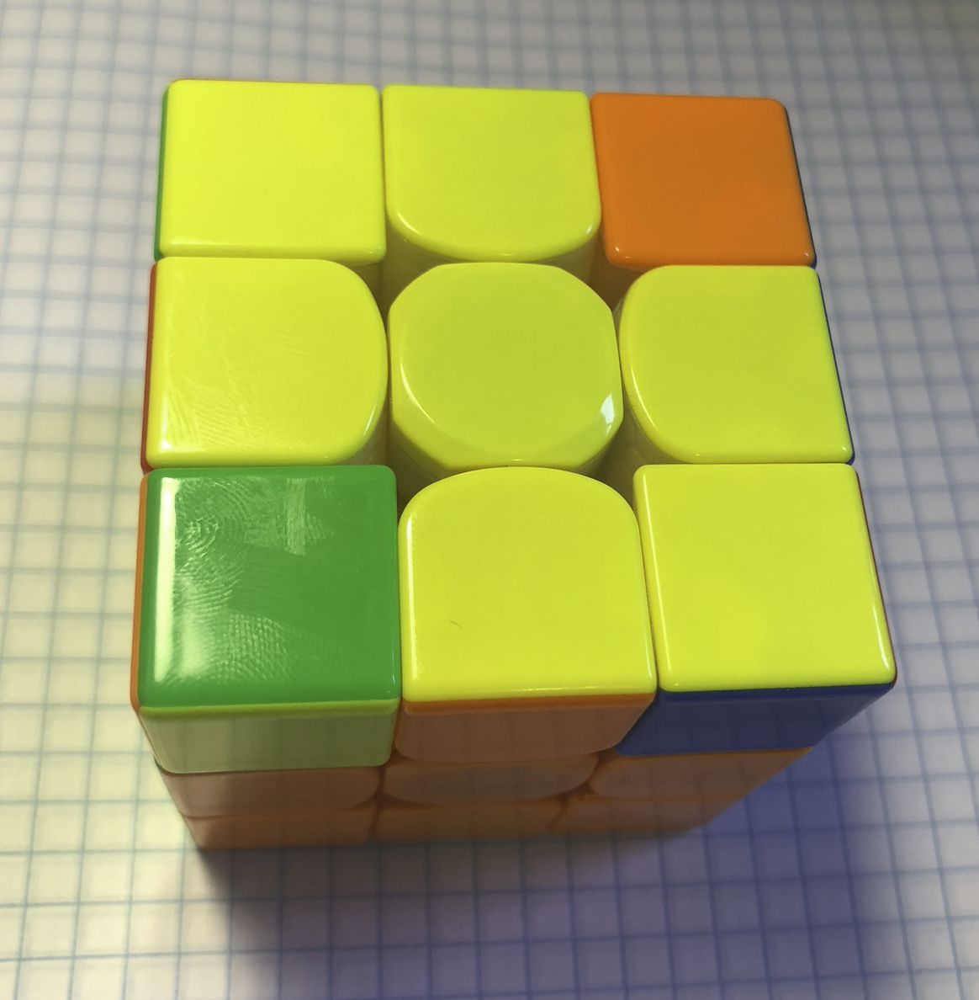
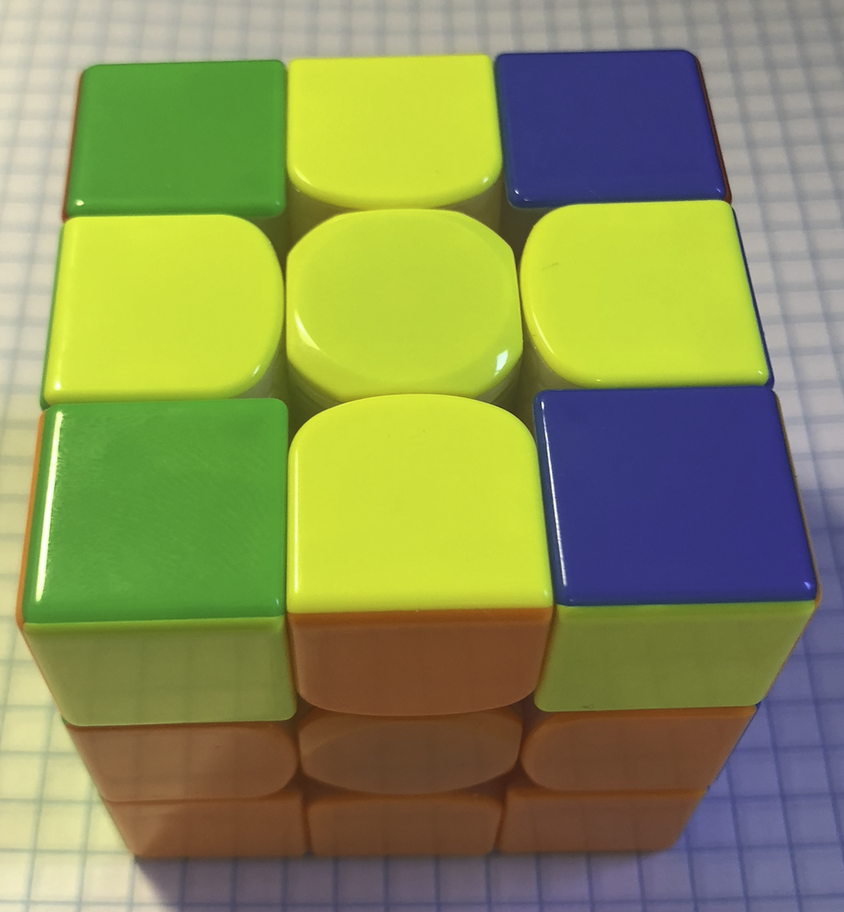
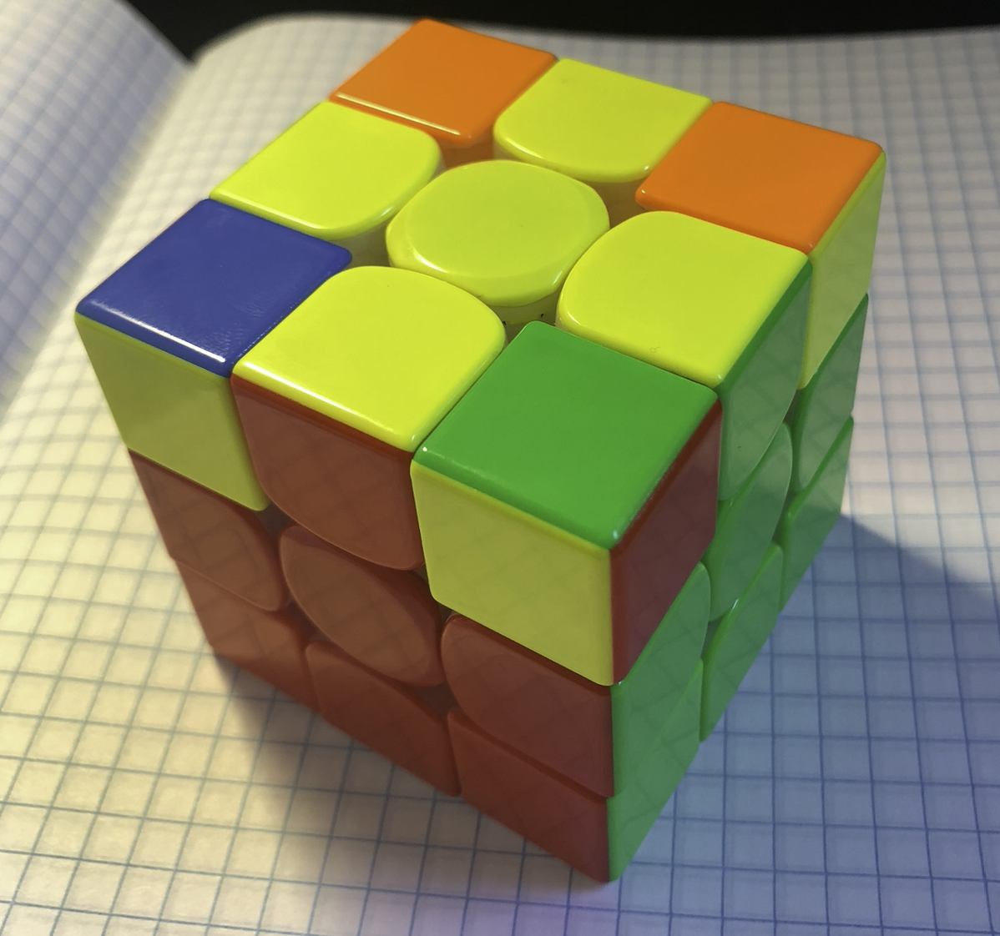
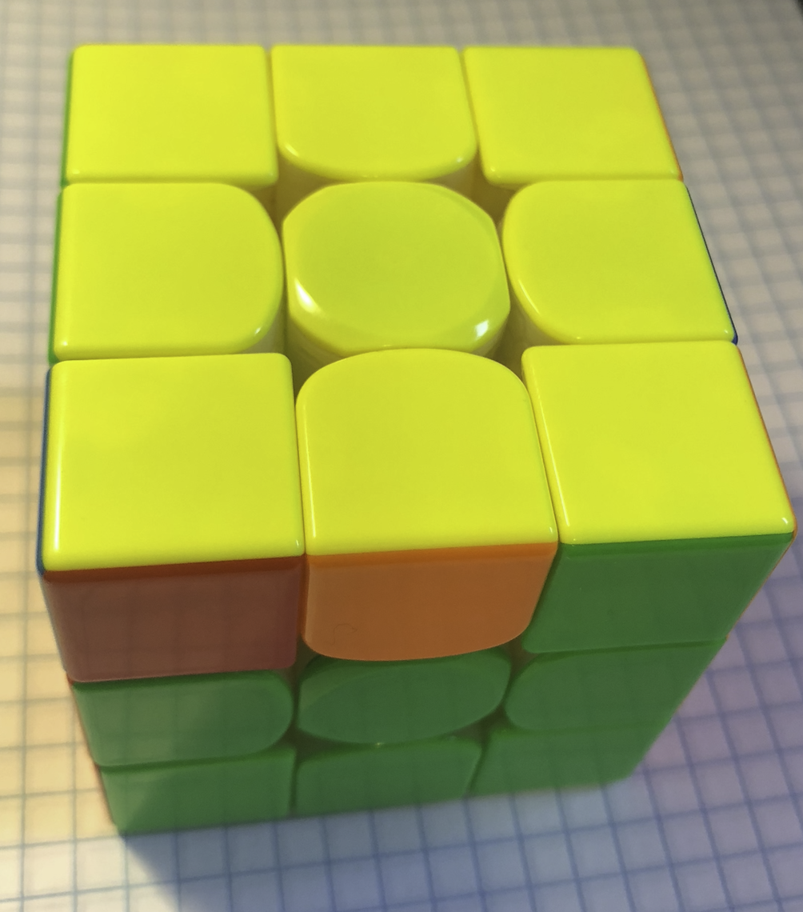
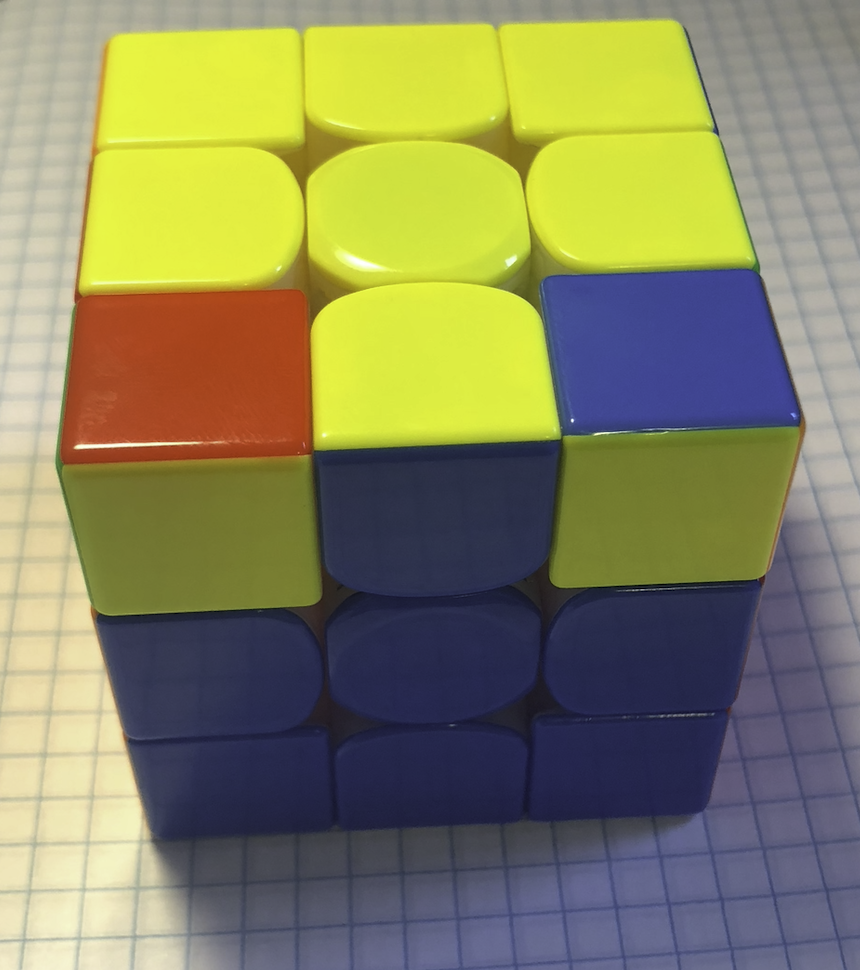
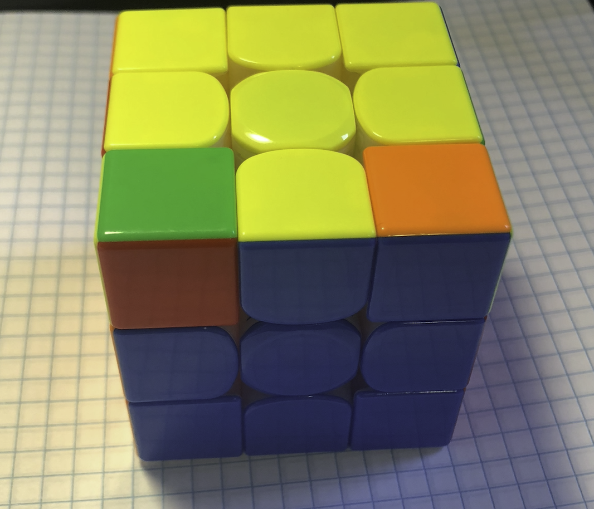

# Rubik's Cube


> Whether you think you can, or you think you can't - you're right.
>
[-Henry Ford](https://en.wikipedia.org/wiki/Henry_Ford)

First off, let me begin with the end in mind.  That is, anyone can solve a Rubik's cube.  It's just something new to learn.  Like all things in life, acquiring a new skill is a simple but *not* easy process which requires humility and continual effort (ie. be humble and don't give up).  For example, look at a child learning how to walk.  The child basically falls over and over again, but keeps getting back up and trying again.  That's how we learn.  We are primitive creatures with primitive brains which are *not* designed to efficiently handle the modern world's "problems".  Our brains require repetition along with focused and diffused modes of thinking to learn.  Our brains operate as a left/right synergistic pair capable of generating understanding, meaning, or semantics, that is, what has been learned, which can only be acquired in hindsight (ie. there is no magical foresight to learning, it takes time and effort).

> Real genius is nothing else but the supernatural virtue of humility in the domain of thought.
>
[-Simone Weil](https://en.wikipedia.org/wiki/Simone_Weil)

I first learned to solve a 3x3 Rubik's cube with the [Beginner's Method](https://ruwix.com/the-rubiks-cube/how-to-solve-the-rubiks-cube-beginners-method/).  This took me about 1-year to accomplish.  That may sound like a long time, but here's the deal: I only practiced learning with the 3x3 cube while compiling a C++ module at work (a task with duration of approximately 2 minutes).  So I learned how to solve the 3x3 cube during this 2 minute compilation window.  After 6 additional months of these "2 minute" practice sessions, I could easily solve the 3x3 cube with the [Beginner's Method](https://ruwix.com/the-rubiks-cube/how-to-solve-the-rubiks-cube-beginners-method/) in under 2 minutes.  At this chronological milestone, I exuded sufficient time and effort into this puzzle to autonomously understand the fundamental movements of the cube and the side-effects of those movements with adjacent and opposite pieces.  This innate understanding of the cube's "balance" can be observed through loop invariants and idempotence.  This astute observation is a fundamental prerequisite for solving the first 2 layers simultaneously because mutable and immutable pieces must be dynamically taken into consideration when formulating the solution.  At this stage, the transformation of serial processing of the left-brain (ie. sequential movements: twist this, turn that, etc.) into "chunks" of data which the right-brain can understand (ie. parallel images/feelings of 3-dimensional alignment) is complete.  These "chunks" of data are then stored in the hippocampus (ie. the brain's long term memory store).  The prefrontal cortex (ie. the smart manager) has somewhere between 4 to 7 working memory slots which can be utilized to interact with the basal ganglia (ie. the stupid repeater) to extract data from the hippocampus to automonously perform the nontrivial task of solving a 3x3 cube via the [Fridrich Method](https://ruwix.com/the-rubiks-cube/advanced-cfop-fridrich/) (ie. CFOP: Cross, F2L, OLL, PLL), which is a natural progression of the intuition accumulated thus far.

During this journey, I acquired ancedotal evidence that simpling deciding upon and taking the next step towards a positive, result-apathy end-goal is the "fast" path towards accomplishing that goal.  This is analgous to going somewhere slowly (and eventually arriving "there").  It follows, the "slow" path is focusing on the end-goal and being negatively critical of the results so far (and never arriving "there" at all).

## Tutorial
> I can only show you the door. You’re the one that has to walk through it.
>
[-Morpheus (The Matrix, 1999)](https://en.wikipedia.org/wiki/The_Matrix)

* [Introduction and Overview](https://www.youtube.com/watch?v=FpV8LeDJlXQ)
* [Know Your Cube](https://www.youtube.com/watch?v=KRiHwcC6oCo)
* [White Cross](https://www.youtube.com/watch?v=4U1eGLw3X8k)
* [White Corners](https://www.youtube.com/watch?v=xIC4tbCTcqo)
* [Middle Layer](https://www.youtube.com/watch?v=DAm2iH-lDFU)

## Demonstrations
* [2022 Cubing with my co-pilot (Harry Potter)](https://www.youtube.com/watch?v=TDZSIdIu0f0)
* [2022 Sub-40 second CFOP solve](https://www.youtube.com/watch?v=pBbMj0WkfUc)
* [2021 Fridrich Method (on Father's Day)](https://www.youtube.com/watch?v=uW24wSNrm5w): It warms my heart that my son likes these kinds of things.  This is a CFOP solve: cross, first 2 layers simultaneously, orientation of the last layer, and permutations of the last layer.
* [2020 Rubik's Cube Solutions: Loop Invariants + Idempotence of OLL + PLL and Fridrich Method](https://www.youtube.com/watch?v=PQrcjo3kj2A&feature=youtu.be)
* [2019 Rubik's Cube Solutions: Beginner's Method and Fridrich Method](http://www.youtube.com/watch?v=lbKGoJQKRRE)

## Beginner's Method

> Take the first step in faith. You don't have to see the whole staircase, just take the first step.
>
[-Martin Luther King Jr.](https://en.wikipedia.org/wiki/Martin_Luther_King_Jr.)

* [https://www.youcandothecube.com/solve-it/3-x-3-solution](https://www.youcandothecube.com/solve-it/3-x-3-solution)
* [https://ruwix.com/the-rubiks-cube/how-to-solve-the-rubiks-cube-beginners-method/](https://ruwix.com/the-rubiks-cube/how-to-solve-the-rubiks-cube-beginners-method/)
* [https://www.ryanheise.com/cube/beginner.html](https://www.ryanheise.com/cube/beginner.html)

## Fridrich Method (ie. CFOP: Cross, F2L, OLL, PLL)
> What are you waiting for? You're faster than this. Don't think you are, know you are.
>
[-Morpheus (The Matrix, 1999)](https://en.wikipedia.org/wiki/The_Matrix)

* [http://en.lerubikscube.com/fridrich-method-3x3/](http://en.lerubikscube.com/fridrich-method-3x3/)

## 3 Look OLL - Orientation of the Last Layer

> To be yourself in a world that is constantly trying to make you something else is the greatest accomplishment.
>
[—Ralph Waldo Emerson](https://en.wikipedia.org/wiki/Ralph_Waldo_Emerson)

In order to solve the cube using the Fridrich Method, over 80 algorithms are needed.  Honestly, I've never really cared to learn all of these sequences.  Instead I ended up creating what I like to refer to as a **3 Look OLL**, for which only 4 algorithms are necessary (obviously this is slower, but only by a few seconds, so that's good enough for me!):

### 1. First Look OLL

Generate the yellow cross `F U R U' R' F'`

### 2. Second Look OLL

Repeat the sequence (```R U R' U R U2 R'```) while the yellow-side is in any of the following states:

#### Fish Swimming Left


#### Fish Swimming Right


#### Diagonals (ie. double headed fish)


#### Double Headlights


#### Chameleon Car


### 3. Third Look OLL

After the Second Look OLL is finished, the yellow-side is in one of the following 3 states:

#### Solved (ie. all yellow pieces are on the same side)


If the yellow side is solved, then move onto the permutations of the last layer (ie. PLL) to properly align the corners and edges of the last layer.  Otherwise, solve the Headlights/Chameleon, then move onto PLL:

#### Headlights

* Turn the cube so that the headlights are on the front face
* Perform the sequence (```R2 D R' U2 R D' R' U2 R'```)
* [See screenshare on YouTube 👀](https://www.youtube.com/shorts/h5J8DKMFn78)

#### Chameleon

* Turn the cube so that the chameleon is facing you.  Perform an X' turn (the whole cube rotated counterclockwise on X axis, ie. the top should now be front)
* Perform the sequence (```R U R' D R U' R' D'```)
* [See screenshare on YouTube 👀](https://www.youtube.com/shorts/ok2RUqkuzXo)

## Resources
* [ruwix.com](https://ruwix.com/)
* [rubiks-cu.be](https://rubiks-cu.be/)
* [rubiks-cube-solver.com](https://rubiks-cube-solver.com/)

## Captain's Log

* *2024-01-08:* **44** seconds
* *2024-01-09:* **41** seconds
* *2024-01-10:* **35** seconds
* *2024-01-11:* **38** seconds
* *2024-01-12:* **45** seconds
* *2024-01-13:* 39.447, 40.842, 41.035
* *2024-01-14:* 40.955, 49.054, 49.398
* *2024-01-15:* 37.287, 40.488, 58.580
* *2024-01-16:* 39.461, 44.170, 46.246
* *2024-01-17:* 41.231, 42.628, 48.888
* *2024-01-18:* 32.652, 34.298, 39.919
* *2024-01-19:* 34.084, 38.763, 41.409, 42.682, 50.173, 55.669, 58.556
* *2024-01-21:* 51.745, 56.610, 54.146, 36.622, 55.918, 35.880, 34.793
* *2024-01-22:* 46.627, 57.897, 56.549, 34.262, 52.512
* *2024-01-23:* 38.619, 45.639, 42.215, 37.971, 37.667, 48.050
* *2024-01-24:* 49.785, 42.651, 50.149
* *2024-01-25:* 43.885, 57.867, 50.095
* *2024-01-26:* 47.706, 52.553, 40.265
* *2024-01-30:* 42.629, 53.586, 42.618
